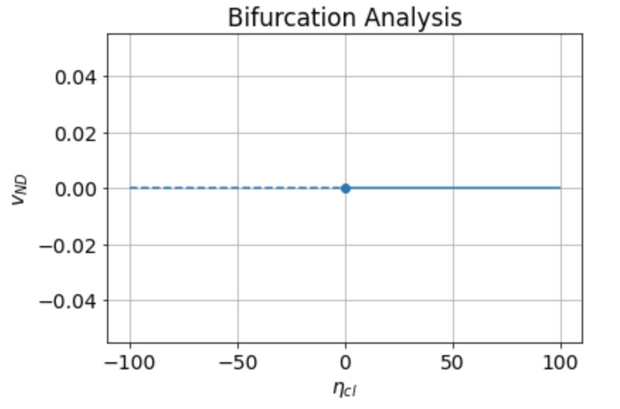

# Modeling Tumor Volume using ODEs
The goal of this project is to replicate results from the paper "A mathematical model of tumor growth and its response to single irradiation"(Link to read: https://www.ncbi.nlm.nih.gov/pmc/articles/PMC4769590/#CR25). In this paper, they define a system of ODEs to model how the volume of a tumor changes over time before, during and after a single dose radiation treatment.

 

*Figure 1: Original Data from the paper I will replicate*

In figure 1, the discrete points are data from a previous study done in rats, measuring tumor volume before and after irradiation. The lines are the model predicted fits for the data. The code reproduce this plot can be found <a href="Project2.ipynb">here</a>.

*Figure 2: Bifurcation Analysis of  in the ODE system*

In figure 2, bifurcation analysis of the parameter , the rate of cell clearance in the tumor, revealed one steady state at y=0. To reproduce the flow on the line analysis that lead to this and the bifurcation plot itself, please go <a href="Project2.ipynb">here</a>.
