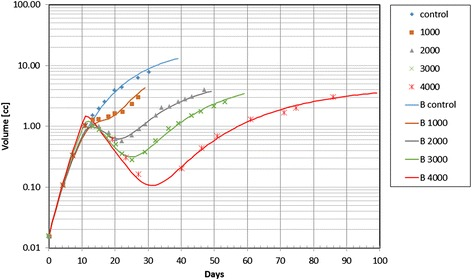

# Modeling Tumor Volume using ODEs
The goal of this project is to replicate results from the paper "A mathematical model of tumor growth and its response to single irradiation"(Link to read: https://www.ncbi.nlm.nih.gov/pmc/articles/PMC4769590/#CR25). In this paper, they define a system of ODEs to model how the volume of a tumor changes over time before, during and after a single dose radiation treatment.

